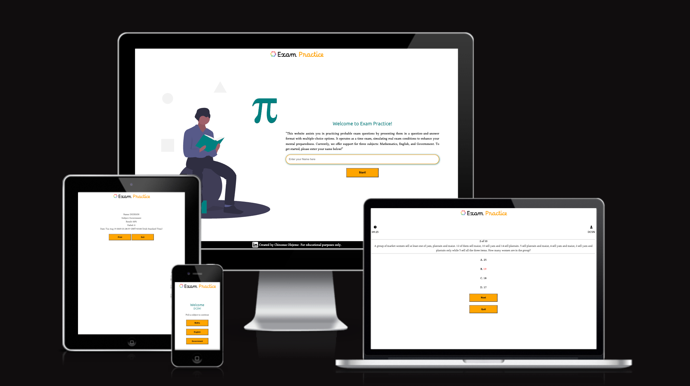
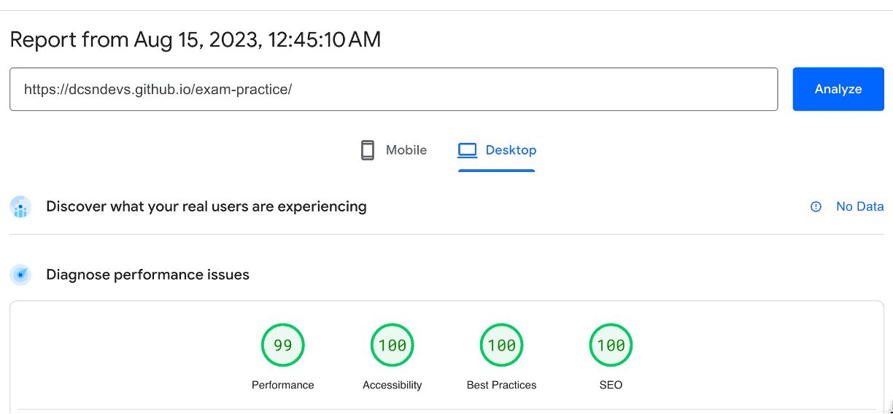
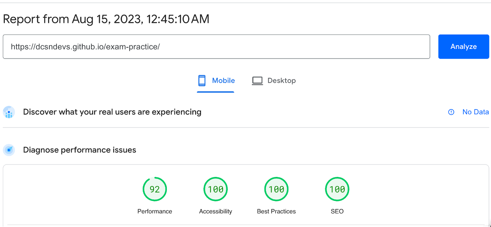
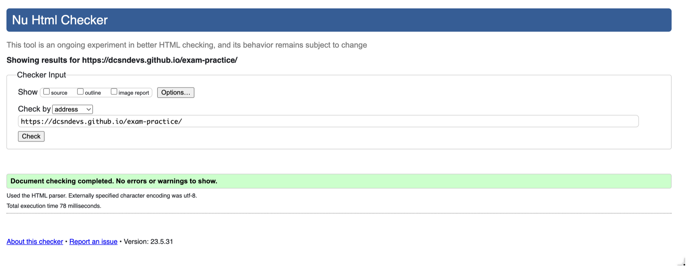
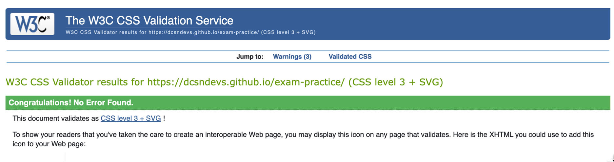
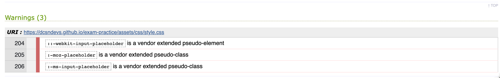
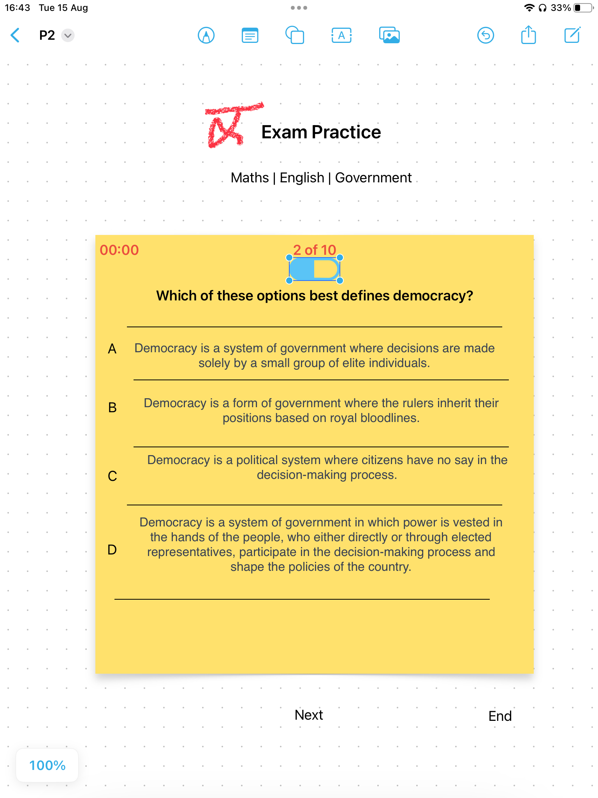

# 

## Welcome,

Examp practice is a quiz website that helps users prepare for exams. It assists in practicing probable exam questions by presenting them in a question-and-answer format with multiple-choice options. It operates as a time exam, simulating real exam conditions to enhance your mental preparedness. Currently, there are three subjects: Mathematics, English, and Government. 

You can find The link to the deployed site [Here](https://dcsndevs.github.io/exam-practice) 

## User Stories

### First Time Visitor Goals: 
As a first-time visitor, the primary goal is to be able to practice past and similar exam questions.

## Returning Visitor Goals:
As a returning visitor, the goal should be to practice more and get acquainted with the exam questions.

## Features 

### Username:
An input form is made available on start. The username gives the user a personalised experience by displaying their chosen name accross the pages of the site.

### Subjects:
There are currently subjects on offering the website application, namely English, Mathematics and Government.

### Timer: 
A timer is activated when an practice sessions starts. This helps the user to simulate real exam conditions. 

### Footer:
The footer section displays the name of the developer and also provides a LinkedIn reference for the developer.

### Result:
The result page is active at the end of every practice session, showing the score, subject, date, time, and usermame. It also provides the user with an opportunity to print the result.

### Testing
Various tools have been used in testing the overall performance of the website from beginning to end. I have listed them in no particular other below:

Responsive Design Tester by Media Genesis was used to view the website on different media screens. Click any title below to view the site's appearance on the screen.

### Manual Testing: 
| Feature | Action | Expected Result | Tested | Passed | Comments |
| --- | --- | --- | --- | --- | --- |
|     |     |     |     |     |     |
| *Front Page* |  |  |  |  |  |
|Focus Input|Key event|Cursor in input field|Yes|Yes|On page load, the cursor is seen in the input field   |
|Start Button|Click|Attempt login|Yes|Yes|     |
|Login Validation|Attempt login|Invalid Login|Yes|Yes|At least 2 and not more than 15 characters when used would activate it|
|LinkedIn icon|Click|Opens a new Linkedin|Yes|Yes||
|Subjects|     |     |     |     |     |
|Government|click|Loads Government questions|Yes|Yes|     |
|Mathematics|click|Loads Mathematics questions|Yes|Yes|     |
|English|click|Loads English questions|Yes|Yes|     |
|Timer|Count down|Starts counting|Yes|Yes|Starts counting onload of new subject questions|
|Time Up|Alert message|Ends practice session|Yes|Yes|An alert pops up as soon as the time counts down to 0|

|Buttons|     |     |     |     |     |
|Next|Click|Loads next question|Yes|Yes|At the last question|
|Quit|Click|Attempts to end the practice session|Yes|Yes|A question is asked, so that the user can confirm|
|Print|Click|Print options opens|Yes|Yes||
|Exit|Click|The website refreshes|Yes|Yes|The front page is reloaded|
|     |     |     |     |     |     |

### Browser Testing: 
The final project was tested on four different browsers, namely:
-Microsoft Internet explorer
-Google Chrome
-Brave
-Mozilla Firefox
The output was similar on all these browsers except on Mozila firefox, where the fonts appeared darker and were therefore better viewed in terms of clarity and contrast. In addition, the buttons on the "get-involved" section (not page) of the index page were observed to overlap the text above them. I was able to correct this error by adding more padding on top of the buttons.

### Google PageSpeed Insights:
Google page speed insights was used to test the speed of the website and various issues were highlighted which was followed by subsequent adjustments.
Issues such as Arial-label not being present were raised, abscen of meta description which I later found out to be because of "Description" was spelt wrongly and issues surrounding image size not being stated.
- Desktop Page Speed Result
- Mobile Page Speed Result

### JSHint:
The JSHint code quality tool was used and 69 warnings were detected. There were no errors, and the warnings were not harmful with most being a result of browser compatibilty.

### HTML Validator:
1. The W3 validator (validator.w3.org) highlighted errors on the website's links. Arial-label instead of aria-label had been used, and 15 errors were found and corrected.
2. An </a> was found without an opener on the footer.

### CSS Validator:
1. The W3 validator highlighted 1 error regarding the use of a wrongly written code for align-items. A value of "right " was used rather than center or start. These codes were then rewritten correctly.
2. The validator highlighted 3 warnings regarding using codes that is a vendor extended pseudo-element.

### WAVE:
WAVE is a web accessibility evaluation tool powered by [WebAIM](https://webaim.org/). WAVE helped identify an initial error were h3 was used without h2 element being in sequence. It also highligh an issue with the  te4xt alignment (Justiify) used. These errors were then corrected. At the second test, no major accessibility error was found except for a minor contrast error concerning the orange color of a part of the logo that's against a white background.

### Color Contrast:

[Deque's University Color Contrast Analyzer](https://dequeuniversity.com/rules/axe/4.7/color-contrast) was used to determine what colors go together This ensures that users of all kind can clearly view texts and image/button borders. Some users might be color blind or are people with low vision experience. This tool ensures that the best colours are used in other to guarantee their convenience. A brief understanding of this would be an instance where a white text is put on a yellow background. Both colors are too bright and would be difficult to read for most users.

## Apple's Freeform:
Freeform was used to draw mock-ups for the initial website design to guide in the development of this project.

## Technologies used:
- JavaScript was used as the main scripting language for the website
- HTML was used to create the frame and for basic text.
- CSS was used to add styles and layout to the website.
- Freeform was used to create wireframes to pre-deign and guide the site's layout and designs
- VScode was used to write and edit the codes and host the site my local computer
- Git was used for the version control of the website
- GitHub was used to host the deployed website
- Undraw opensource was used obtain svg image for the hero image
- Canva was used to creat the site Logo

## Deployment

The site was deployed using Github and was pushed through via Vscode.
The repository was created on Github and then cloned on Vscode. After creating the site on Vscode, it was pushed onto Github.
The site was then deployed via Github pages by:

    - Selecting the settings tab inside the repo on Github
    - Selecting Deploy from a branch under 'Build and deployment'
    - Selecting Main under branch
    - Click save
After these steps, the site would have been deployed and becomes live at <https://dcsndevs.github.io/exam-practice>

### Local Deployment:
To clone this project, you can do so using VsCode or any code editor that has an integrated development Environment (IDE), using this command: 

     git clone https://github.com/dcsndevs/exam-practice.git 

## Credits

### Content:
- Inspiration for creatin g the countdown timer was gotten from Florin Pop's YouTube video. [Florin Pop](https://www.youtube.com/watch?v=x7WJEmxNlEs)

### Fonts & Icons:
The fonts used were imported from [Google Fonts]("https://fonts.google.com/) and the Icons were from [Font Awesome](https://fontawesome.com/) 
Regular 400 Font Borel (logo), Ubuntu (paragraphs), and Ruwudu(headings) were used. 

### Colors:
Black, Orange and Teal were the main colors used for this site. 

### Images:
- The main hero image of a character studying a book, was gotten from free open source site (Undraw.co) designed by [Aggelos Gesoulis](https://twitter.com/anges244) and created by [Katerina Limpitsouni](https://twitter.com/ninaLimpi).
- The logo was crerated using Canva.com

 - [Image Resizer](https://imageresizer.com/) and [TinyPng](https://tinypng.com/) were used to respectively resize and compress all the images on this site.
 - [Ezgif.com](https://ezgif.com/) was used to covert videos to the animated gif images that was used to show live tests.
 - [Screenshot & Screen Recorder](https://ezgif.com/) was used to record live tests and used to create videos therefore.
 - [Am I Responsive](https://ami.responsivedesign.is/) website was used to simultaneously display how the site looks on different screen sizes.

### Acknowledgements:
I like to thank [Juliia Konn](https://github.com/IuliiaKonovalova/), my mentor at Code Institute. She exemplifies her mentorship with a knack for high quality projects. Her desire for quality has always pushe me to do better in my work. I remain grateful to her.

I also like to thank my loving wife for her continuos support. She's a source of strength as always.